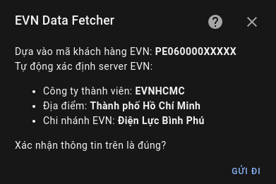
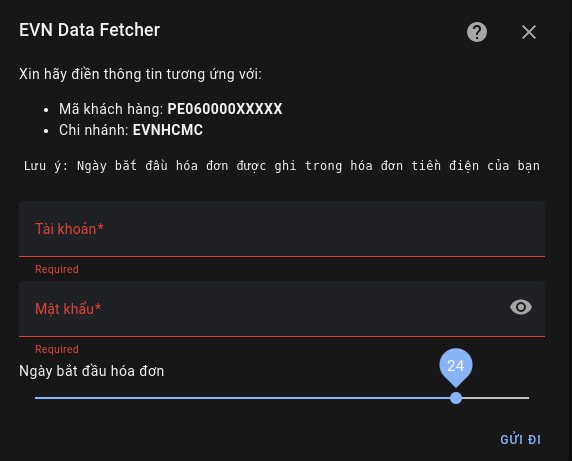
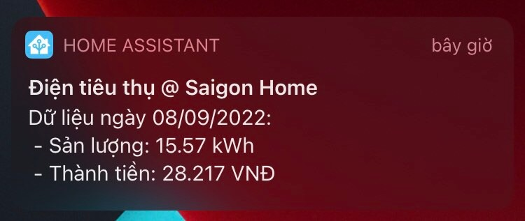

[![hacs][hacs-badge]][hacs]
[![Project Maintenance][maintenance-badge]][maintenance]
[![Code Style][black-badge]][black]

## Công cụ theo dõi điện năng tiêu thụ từ EVN Việt Nam dành cho HomeAssistant

#### [English](https://github.com/trvqhuy/ha-evn/blob/main/README_en.md) | Tiếng Việt

Từ việc sử dụng các phương thức có sẵn của module **AIOHTTP** thông qua những giao thức **HTTP(S)** cơ bản, công cụ cho phép theo dõi dữ liệu điện năng tiêu thụ từ [EVN](https://www.evn.com.vn) trực tiếp trên UI [Home Assistant](https://www.home-assistant.io), hiện tại đã hỗ trợ cho **tất cả vùng miền** tại Việt Nam cùng với chi nhánh EVN tương ứng (xem tại [danh sách phía dưới](https://github.com/trvqhuy/nestup_evn/edit/main/README_vn.md#l%C6%B0u-%C3%BD-tr%C6%B0%E1%BB%9Bc-khi-c%C3%A0i-%C4%91%E1%BA%B7t)).

### Các tính năng cơ bản
1. Thiết lập và theo dõi **nhiều mã khách hàng** cùng một lúc, trên cùng **một máy chủ HA**.
2. Cài đặt và chỉnh sửa **trực tiếp bằng UI (thông qua HACS)**, quản lí các thông số điện năng thông qua các thiết bị theo dõi tập trung.
3. Hỗ trợ cho **tất cả** chi nhánh EVN toàn quốc (bao gồm 5 tổng công ty và hơn 400 chi nhánh lớn nhỏ).
4. **Tự động** xác định máy chủ EVN.
5. Tương thích với tất cả platform HA: Core, Supervisors, Hass OS.


## Lưu ý trước khi cài đặt
### 1. Phiên bản Home Assistant: tối thiểu 2022.7.0
### 2. Công tơ điện EVN
Công cụ chỉ hỗ trợ cho loại công tơ **điện tử đo xa ghi theo ngày**:
- Không phải tất cả công tơ **điện tử** đều hỗ trợ đọc chỉ số từ xa **(đo xa)**.
- Không phải tất cả công tơ **điện tử đo xa** đều hỗ trợ **ghi theo ngày**.

    > Để đảm bảo công tơ nhà bạn đủ điều kiện để sử dụng công cụ, xin hãy truy cập vào link [Đăng nhập](https://github.com/trvqhuy/nestup_evn/edit/main/README_vn.md#l%C6%B0u-%C3%BD-tr%C6%B0%E1%BB%9Bc-khi-c%C3%A0i-%C4%91%E1%BA%B7t) phía dưới (xin chọn tương ứng với khu vực EVN của bạn).
    
    > Nếu như bạn có thể theo dõi được **sản lượng theo ngày** trên website hoặc app chính thức của EVN, thì công tơ nhà bạn thích hợp để sử dụng công cụ này.

### 3. Mã khách hàng và tài khoản EVN
Hiện tại tất cả chi nhánh, vùng miền đều **cần phải có tài khoản EVN** tương ứng với **mã khách hàng** để sử dụng công cụ.

**Tài khoản EVN** hợp lệ sẽ bao gồm:
1. Tên tài khoản / Username (thông thường sẽ là mã khách hàng hoặc số điện thoại) 
2. Mật khẩu / Password.

**Mã khách hàng** của bạn phải thỏa những điều kiện sau:

1. Chứa từ **11 tới 13 kí tự**.
2. Bắt đầu bằng chữ **'P'**.

**Chú ý**: Kiểm tra ở bảng phía dưới, liên hệ với TTCSKH (Trung tâm Chăm sóc Khách Hàng) để xin thông tin đăng nhập nếu chưa có:

| Chi nhánh EVN | Khu vực | Đang được hỗ trợ | Đăng nhập | TTCSKH |
|:---:|:---:|:---:|:---:|:---:|
| EVNHANOI | Thủ đô Hà Nội | ☑️ | [Link](https://evnhanoi.vn/user/login)| [Link](https://evnhanoi.vn/infomation/lien-he)
| EVNHCMC | Thành phố Hồ Chí Minh | ☑️ | [Link](https://cskh.evnhcmc.vn/)| [Link](https://cskh.evnhcmc.vn/lienhe)
| EVNNPC | Các tỉnh miền Bắc | ☑️ | [Link](https://cskh.npc.com.vn/home/AccountNPC)| [Link](https://cskh.npc.com.vn/Home/LienHeNPC)
| EVNCPC | Các tỉnh miền Trung | ☑️ | [Link](https://cskh.cpc.vn/dang-nhap)| [Link](https://cskh.cpc.vn/lien-he)
| EVNSPC | Các tỉnh miền Nam | ☑️ | [Link](https://www.cskh.evnspc.vn/TaiKhoan/DangNhap)| [Link](https://cskh.evnspc.vn/LienHe/CacKenhTrucTuyen)
    
## Cài đặt
#### **Chú ý:** Sử dụng 1 trong những cách phía dưới để cài đặt công cụ vào HA.
### Cách 1: Cài đặt thông qua [HACS](https://hacs.xyz) (khuyến nghị).
1. Tải repository package về máy chủ HA.

     

    > HACS > Integrations > ➕ Explore & download repositories  > `EVN Data Fetcher` > `Chọn phiên bản mới nhất` > Download this repository
    
3. Khởi động lại HomeAssistant.
4. Cài đặt thành công, tiếp theo đến bước [Config](https://github.com/trvqhuy/nestup_evn/blob/main/README_vn.md#thi%E1%BA%BFt-l%E1%BA%ADp-v%C3%A0-ch%E1%BB%89nh-s%E1%BB%ADa) để hoàn thành.

### Cách 2: Cài đặt thủ công thông qua Samba / SFTP
1. Tải phiên bản mới nhất của công cụ thông qua [Github](https://github.com/trvqhuy/nestup_evn.git).

2. Giải nén thư mục `custom_components/nestup_evn` vào thư mục `custom_components` trong HomeAssistant của bạn.
    - Thư mục `custom_components` phụ thuộc vào **thư mục cài đặt** HomeAssistant của bạn. 
    - Thông thường, **thư mục cài đặt** HomeAssistant sẽ là `~/homeassistant/`.
    - Nói cách khác, **thư mục cài đặt** HomeAssistant là thư mục chứa file `configuration.yaml`.
    - Sau khi cài đặt đúng, đường dẫn sẽ có dạng:
    
        ```
        └── ...
        └── configuration.yaml
        └── secrets.yaml
        └── custom_components
            └── nestup_evn
                └── __init__.py
                └── sensor.py
                └── nestup_evn.py
                └── ...
        ```
    **Chú ý**: nếu thư mục `custom_components` không tồn tại, bạn phải tự tạo nó.
 
## Thiết lập và Chỉnh sửa
### Cách thiết lập công cụ
#### 1. Tìm công cụ `EVN Data Fetcher` trong những công cụ đã tải về.
> Settings > Devices and Services > Integrations > Add Integrations > Tìm `EVN Data Fetcher`


    

#### 2. Điền `Mã khách hàng`.

**Yêu cầu**: Mã khách hàng của bạn phải thỏa những điều kiện sau:

- Chứa từ **11** tới **13** kí tự.
- Bắt đầu bằng chữ **'P'**.

 
    

#### 3. Điền `Tài khoản EVN` và chọn `Ngày bắt đầu hóa đơn`.
**Chú ý**: **ngày bắt đầu hóa đơn** là ngày đầu tiên trong hóa đơn điện hàng tháng (xem hóa đơn các kì trước để chắc chắn). 


    

#### 4. Hoàn thành, bây giờ bạn có thể thấy thiết bị theo dõi của mình ở phần Devices.
    

    
## Home Assistant: Cách tạo Automation thông báo điện năng tiêu thụ mỗi ngày



**Lưu ý**: thay thế tên thiết bị của bạn (unique_id) vào **5** phần `ten_device_cua_ban` ở phía dưới.

```yaml
alias: Thông báo điện năng tiêu thụ mỗi ngày
trigger:
# Tùy chỉnh thời gian cố định mỗi ngày để thông báo (ví dụ 8:00 sáng mỗi ngày)
  - platform: time
    at: "08:00:00"
condition:
  - condition: template
    value_template: >-
# Thông thường dữ liệu điện tiêu thụ mới nhất sẽ là của ngày trước đó, 
#   ví dụ hôm nay ngày 09/09/2022 thì dữ liệu mới nhất là của ngày 08/09/2022
        {{ states('sensor.ten_device_cua_ban_ngay_moi_nhat') == (now() - timedelta(days=1)).strftime('%d/%m/%Y')}}

# Nếu như ở khu vực của bạn, dữ liệu điện tiêu thụ từ EVN luôn cập nhật trễ hơn, 
#   xin hãy thay bằng template phía dưới, với X là số ngày trễ hơn:
# Ví dụ hôm nay là ngày 09/09/2022, dữ liệu mới nhất là của ngày 06/09/2022, 
#   luôn trễ hơn 3 ngày, thì X = 3.
#       {{ states('sensor.ten_device_cua_ban_ngay_moi_nhat') == (now() - timedelta(days=X)).strftime('%d/%m/%Y')}}

action:
# Tùy chình bằng service notify của bạn
  - service: notify.notify
    data:
      title: Điện tiêu thụ @ Saigon Home
      message: >
        Dữ liệu ngày
        {{states('sensor.ten_device_cua_ban_ngay_moi_nhat')}}:{{'\n'}} -
        Sản lượng:
        {{states('sensor.ten_device_cua_ban_san_luong_ngay_moi_nhat')}}
        kWh{{'\n'}} - Thành tiền:
        {{'{0:_.0f}'.format(states('sensor.ten_device_cua_ban_tien_dien_ngay_moi_nhat')|int).replace('_',
        '.')}} VNĐ
mode: single
```

### Chỉnh sửa thông số
> Hiện tại, sau khi đã thiết lập, các thông số của công cụ chưa thể chỉnh sửa, có thể tính năng này sẽ được cập nhật trong tương lai, hoặc có thể không.

> Tuy nhiên, những thông số này "có vẻ như" sẽ không cần phải chỉnh sửa, hiện tại đã được gán mặc định như bên dưới.

#### 1. Ý nghĩa của các sensor được tạo sẵn:

Do thiếu sự đồng bộ về các khái niệm chỉ số điện năng giữa các chi nhánh và tổng công ty EVN, các sensors sẽ được thống nhất như bên dưới:

- **Ngày mới nhất**: (không phải ngày hôm nay) là ngày **đã có đầy đủ các thông tin** về điện năng tiêu thụ - (theo lý thuyết) được tính từ **00:00** đến **23:59** trong ngày đó.

- **Ngày bắt đầu hóa đơn**: là ngày đầu tiên trong hóa đơn điện tiêu thụ hàng tháng (xem hóa đơn của các kì trước để biết).

- **Sản lượng ngày mới nhất**: là sản lượng điện tiêu thụ được tính (theo lý thuyết) từ **00:00** đến **23:59** của **ngày mới nhất**.

- **Sản lượng tháng**: là sản lượng điện tiêu thụ được tính (theo lý thuyết) từ **00:00** của **ngày bắt đầu hóa đơn** đến **23:59** của **ngày mới nhất**.

Để thuận tiện hơn trong việc theo dõi điện tiêu thụ hàng ngày (ví dụ ước lượng số tiền điện mình sử dụng trong ngày). 2 sensors bên dưới chỉ mang **tính chất tham khảo**, không được lấy trực tiếp từ dữ liệu EVN, mà được tính theo giá bán lẻ bên dưới nên khả năng **sai số là rất cao****

- **Tiền điện ngày**: được tính từ **sản lượng ngày mới nhất**.

- **Tiền điện tháng**: được tính từ **sản lượng tháng**.
    
#### 2. Giá bán lẻ điện EVN:

Mặc dù có nhiều loại biểu giá tùy vào mục đích sử dụng điện, nhưng dự án này sẽ mặc định tính giá tiền điện theo biểu giá bán lẻ của nhóm đối tượng `Sinh Hoạt`.
> Truy cập [link](https://www.evn.com.vn/c3/evn-va-khach-hang/Bieu-gia-ban-le-dien-9-79.aspx) này để xem biểu giá bán lẻ tiền điện của EVN.
    
#### 3. Chu kì cập nhật dữ liệu mới từ EVN:

` 6 tiếng ` là chu kì mặc định giữa các lần cập nhật dữ liệu điện năng tiêu thụ từ EVN.
> Việc cập nhật dữ liệu theo chu kì, không cố định 1 mốc thời gian cụ thể, lí do là:
> - Để các sensors luôn cập nhật được dữ liệu mới nhất từ EVN.
> - Thời điểm cập nhật dữ liệu điện năng của hơn 400 chi nhánh EVN toàn quốc là không cố định.

## Dành cho dự án

#### Xin phép được gửi lời cảm ơn đến:

- Anh **Pham Dinh Hai** và anh **Huynh Nhat**, vì đã tin tưởng, cung cấp thông tin tài khoản EVNHANOI và EVNCPC, nhờ vậy chủ repo có đủ điều kiện cần thiết để code hỗ trợ cho khu vực Hà Nội và miền Trung Việt Nam.  

- Anh **Hoang Tung V**, vì những đóng góp cực kì to lớn.

> Không có những người kể trên, repo `nestup_evn` sẽ không ở đây, trở thành một dự án open-source tới cộng đồng HA Việt Nam.

> Lời cuối, chủ repo cũng muốn tự cảm ơn bản thân vì đã tạo ra integration này dành cho tất cả mọi người.

[hacs]: https://github.com/custom-components/hacs
[hacs-badge]: https://img.shields.io/badge/HACS-default-0468BF.svg?style=for-the-badge
[black-badge]: https://img.shields.io/badge/code%20style-black%20&%20flake8-262626.svg?style=for-the-badge
[black]: https://github.com/ambv/black
[maintenance-badge]: https://img.shields.io/badge/MAINTAINER-%40TRVQHUY-F2994B?style=for-the-badge
[maintenance]: https://github.com/trvqhuy
[license-badge]: https://img.shields.io/badge/license-apache2.0-F2994B.svg?style=for-the-badge
[license]: https://github.com/trvqhuy/nestup_evn/blob/main/custom_components/nestup_evn/LICENSE
